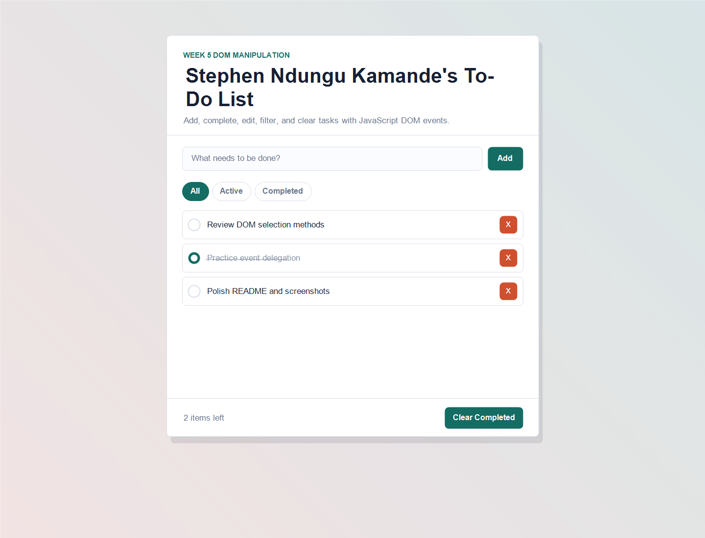
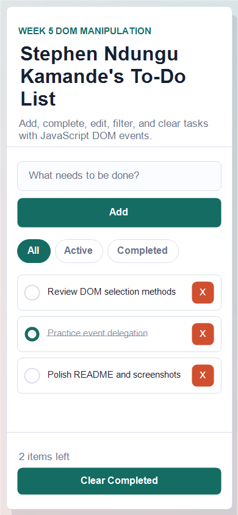

# Week 5: DOM Manipulation To-Do List

An interactive to-do list application built for the Week 5 DOM Manipulation assignment by **Stephen Ndungu Kamande**.

## Live Demo

[Open the live demo](https://theecolboy.github.io/week-5-iyf-dom-munipulation/)

If the link shows a 404 immediately after a new push, GitHub Pages may still be deploying. Refresh the page after a minute and confirm the repository has GitHub Pages enabled from the `main` branch root.

## Screenshots

### Desktop



### Mobile



## Features

- Add new tasks with the form or Enter key.
- Toggle tasks between active and completed.
- Delete tasks with the task delete button.
- Filter tasks by all, active, or completed.
- Track remaining active tasks.
- Clear completed tasks.
- Double-click a task to edit it, then press Enter to save or Escape to cancel.
- Responsive layout that works well on desktop, tablet, and mobile screens.

## Built With

- HTML
- CSS
- JavaScript DOM manipulation
- Event listeners and event delegation

## Project Structure

```text
.
+-- index.html
+-- styles.css
+-- app.js
+-- screenshots/
|   +-- todo-desktop.png
|   +-- todo-mobile.png
+-- README.md
```

## Run Locally

Open `index.html` directly in a browser, or serve the folder from localhost:

```bash
python -m http.server 8000
```

Then visit `http://localhost:8000`.

## Author

Stephen Ndungu Kamande
